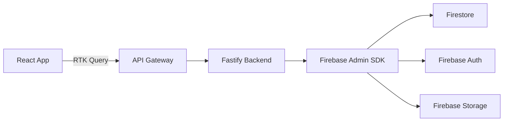

# VOYENGO - Architecture Technique Détaillée

## 🏗️ Stack Technique

### Frontend
- **Framework**: React 18 avec Vite
- **Language**: TypeScript
- **State Management**: Redux Toolkit + RTK Query
- **UI**: Tailwind CSS + Headless UI
- **Routing**: React Router v6
- **Forms**: React Hook Form + Zod
- **Icons**: Heroicons
- **Date handling**: date-fns
- **Maps**: Mapbox GL JS ou Leaflet

### Backend
- **Framework**: Fastify avec TypeScript
- **Database**: Firebase Firestore
- **Authentication**: Firebase Auth
- **File Storage**: Firebase Storage
- **Validation**: Zod + Fastify built-in validation
- **API Documentation**: Fastify Swagger
- **Logging**: Pino
- **Environment**: dotenv

### DevOps & Tools
- **Version Control**: Git (Monorepo structure)
- **Package Manager**: npm (workspace support)
- **Linting**: ESLint + Prettier
- **Testing**: Vitest (frontend) + Jest (backend)
- **CI/CD**: GitHub Actions
- **Deployment**: Vercel (frontend) + Render (backend)
- **Monitoring**: Sentry

## 📁 Structure du Projet

```
voyengo/
├── packages/
│   ├── frontend/                 # Application React
│   │   ├── src/
│   │   │   ├── components/       # Composants réutilisables
│   │   │   ├── features/         # Modules par fonctionnalité
│   │   │   ├── pages/           # Pages de l'application
│   │   │   ├── hooks/           # Custom hooks
│   │   │   ├── store/           # Redux store & slices
│   │   │   ├── services/        # API services (RTK Query)
│   │   │   ├── utils/           # Fonctions utilitaires
│   │   │   ├── types/           # Types TypeScript
│   │   │   └── styles/          # Styles globaux
│   │   ├── public/
│   │   └── package.json
│   │
│   ├── backend/                  # API Fastify
│   │   ├── src/
│   │   │   ├── modules/         # Modules métier
│   │   │   │   ├── auth/
│   │   │   │   ├── users/
│   │   │   │   ├── offers/
│   │   │   │   ├── requests/
│   │   │   │   ├── messages/
│   │   │   │   └── admin/
│   │   │   ├── plugins/         # Plugins Fastify
│   │   │   ├── utils/           # Utilitaires
│   │   │   ├── types/           # Types partagés
│   │   │   └── config/          # Configuration
│   │   └── package.json
│   │
│   └── shared/                   # Code partagé
│       ├── types/               # Types TypeScript communs
│       ├── constants/           # Constantes
│       └── validations/         # Schémas Zod
│
├── .github/
│   └── workflows/               # GitHub Actions
├── docs/                        # Documentation
├── scripts/                     # Scripts de build/deploy
├── npm-workspace.yaml
├── .gitignore
├── .env.example
└── README.md
```

## 🗄️ Modèles de Données (Firestore)

### Collections Principales

#### users
```typescript
interface User {
  id: string;
  email: string;
  displayName: string;
  photoURL?: string;
  role: 'traveler' | 'sender' | 'admin';
  phoneNumber?: string;
  bio?: string;
  rating: number;
  reviewCount: number;
  verificationStatus: {
    email: boolean;
    phone: boolean;
    identity: boolean;
  };
  createdAt: Timestamp;
  updatedAt: Timestamp;
}
```

#### offers
```typescript
interface TravelOffer {
  id: string;
  userId: string;
  status: 'active' | 'completed' | 'cancelled';
  route: {
    from: {
      city: string;
      country: string;
      coordinates: GeoPoint;
    };
    to: {
      city: string;
      country: string;
      coordinates: GeoPoint;
    };
  };
  travelDate: Timestamp;
  returnDate?: Timestamp;
  availableSpace: {
    weight: number; // kg
    dimensions?: string;
  };
  acceptedItems: string[]; // ['documents', 'electronics', 'clothing', etc.]
  prohibitedItems: string[];
  pricing: {
    basePrice: number;
    pricePerKg: number;
    currency: string;
  };
  description?: string;
  createdAt: Timestamp;
  updatedAt: Timestamp;
}
```

#### requests
```typescript
interface ShippingRequest {
  id: string;
  senderId: string;
  status: 'pending' | 'matched' | 'in_transit' | 'delivered' | 'cancelled';
  item: {
    type: string;
    description: string;
    weight: number;
    dimensions?: string;
    value: number;
    photos: string[];
  };
  route: {
    from: Location;
    to: Location;
  };
  desiredDate: Timestamp;
  flexibleDates: boolean;
  budget: {
    max: number;
    currency: string;
  };
  matchedOfferId?: string;
  createdAt: Timestamp;
  updatedAt: Timestamp;
}
```

#### messages
```typescript
interface Message {
  id: string;
  conversationId: string; // offerId ou requestId
  senderId: string;
  receiverId: string;
  content: string;
  attachments?: string[];
  read: boolean;
  createdAt: Timestamp;
}
```

#### transactions
```typescript
interface Transaction {
  id: string;
  offerId: string;
  requestId: string;
  travelerId: string;
  senderId: string;
  status: 'pending' | 'confirmed' | 'in_transit' | 'delivered' | 'disputed';
  amount: number;
  currency: string;
  timeline: {
    confirmed?: Timestamp;
    pickedUp?: Timestamp;
    delivered?: Timestamp;
  };
  proofOfDelivery?: {
    photos: string[];
    signature?: string;
    notes?: string;
  };
  createdAt: Timestamp;
  updatedAt: Timestamp;
}
```

## 🔐 Sécurité & Authentification

### Firebase Auth Flow
1. **Inscription**: Email/Password + Google/Facebook OAuth
2. **Vérification email**: Obligatoire avant utilisation complète
3. **Tokens**: Firebase ID tokens (1h expiration)
4. **Refresh**: Automatique via Firebase SDK

### Règles de Sécurité Firestore
```javascript
// Exemple de règles
match /users/{userId} {
  allow read: if request.auth != null;
  allow write: if request.auth.uid == userId;
}

match /offers/{offerId} {
  allow read: if request.auth != null;
  allow create: if request.auth != null && 
    request.auth.token.role == 'traveler';
  allow update, delete: if request.auth.uid == resource.data.userId;
}
```

### API Security (Backend)
- Rate limiting avec @fastify/rate-limit
- CORS configuration stricte
- Validation des inputs avec Zod
- Sanitization des données
- HTTPS obligatoire en production

## 🚀 Flux de Données

### Architecture des API Calls



### Exemple de Flow: Création d'une Offre

1. **Frontend**: Formulaire avec validation React Hook Form
2. **Redux**: Dispatch createOffer action via RTK Query
3. **Backend**: POST /api/offers
   - Validation avec Zod
   - Vérification auth token
   - Création document Firestore
   - Indexation pour recherche
4. **Response**: Nouvelle offre avec ID
5. **Frontend**: Update Redux store + navigation

## 📱 Pages & Routes

### Frontend Routes
```typescript
const routes = [
  // Public
  { path: '/', component: HomePage },
  { path: '/login', component: LoginPage },
  { path: '/register', component: RegisterPage },
  { path: '/offers', component: OffersListPage },
  { path: '/offers/:id', component: OfferDetailPage },
  
  // Authenticated
  { path: '/dashboard', component: DashboardPage, protected: true },
  { path: '/profile', component: ProfilePage, protected: true },
  { path: '/my-offers', component: MyOffersPage, protected: true },
  { path: '/my-requests', component: MyRequestsPage, protected: true },
  { path: '/messages', component: MessagesPage, protected: true },
  { path: '/messages/:conversationId', component: ChatPage, protected: true },
  
  // Admin
  { path: '/admin', component: AdminDashboard, role: 'admin' },
  { path: '/admin/users', component: UsersManagement, role: 'admin' },
  { path: '/admin/reports', component: ReportsPage, role: 'admin' },
];
```

### Backend API Endpoints
```typescript
// Auth
POST   /api/auth/register
POST   /api/auth/login
POST   /api/auth/refresh
POST   /api/auth/logout
GET    /api/auth/me

// Users
GET    /api/users/:id
PUT    /api/users/:id
POST   /api/users/:id/verify
POST   /api/users/:id/upload-document

// Offers
GET    /api/offers (with filters: from, to, date, type)
POST   /api/offers
GET    /api/offers/:id
PUT    /api/offers/:id
DELETE /api/offers/:id

// Requests
GET    /api/requests
POST   /api/requests
GET    /api/requests/:id
PUT    /api/requests/:id
POST   /api/requests/:id/match

// Messages
GET    /api/conversations
GET    /api/conversations/:id/messages
POST   /api/conversations/:id/messages
PUT    /api/messages/:id/read

// Transactions
POST   /api/transactions
GET    /api/transactions/:id
PUT    /api/transactions/:id/status

// Admin
GET    /api/admin/stats
GET    /api/admin/users
PUT    /api/admin/users/:id/status
GET    /api/admin/reports
```

## 🎨 Design System

### Couleurs
```css
:root {
  --primary: #3B82F6;      /* Blue 500 */
  --primary-dark: #2563EB; /* Blue 600 */
  --secondary: #10B981;    /* Emerald 500 */
  --danger: #EF4444;       /* Red 500 */
  --warning: #F59E0B;      /* Amber 500 */
  --gray-50: #F9FAFB;
  --gray-900: #111827;
}
```

### Composants UI Principaux
- **Button**: Variants (primary, secondary, outline, ghost)
- **Card**: Pour offers, requests, user profiles
- **Modal**: Dialogs, confirmations
- **Form Controls**: Input, Select, DatePicker, FileUpload
- **Navigation**: Header, Sidebar, BottomNav (mobile)
- **Feedback**: Toast, Alert, Loading states

## 🧪 Testing Strategy

### Frontend Tests
- **Unit Tests**: Components avec React Testing Library
- **Integration Tests**: User flows
- **E2E Tests**: Cypress pour parcours critiques

### Backend Tests
- **Unit Tests**: Services et utils
- **Integration Tests**: API endpoints
- **Load Tests**: K6 pour performance

## 📊 Monitoring & Analytics

### Application Monitoring
- **Sentry**: Error tracking
- **Google Analytics**: User behavior
- **Firebase Analytics**: Mobile-specific events

### Performance Metrics
- Core Web Vitals
- API response times
- Database query performance
- Storage usage

## 🚀 Deployment Pipeline

### CI/CD avec GitHub Actions
1. **On Push to main**:
   - Run tests
   - Build applications
   - Deploy frontend to Vercel
   - Deploy backend to Render

### Environment Variables
```env
# Frontend
VITE_FIREBASE_API_KEY=
VITE_FIREBASE_AUTH_DOMAIN=
VITE_FIREBASE_PROJECT_ID=
VITE_API_URL=

# Backend
FIREBASE_SERVICE_ACCOUNT=
PORT=
NODE_ENV=
CORS_ORIGIN=
```

## 📈 Évolutions Futures

1. **Mobile App**: React Native avec partage de code
2. **Real-time**: WebSockets pour chat instantané
3. **AI Matching**: Algorithme de recommandation ML
4. **Blockchain**: Smart contracts pour transactions
5. **Multi-langue**: i18n support
6. **API Publique**: Pour intégrations tierces